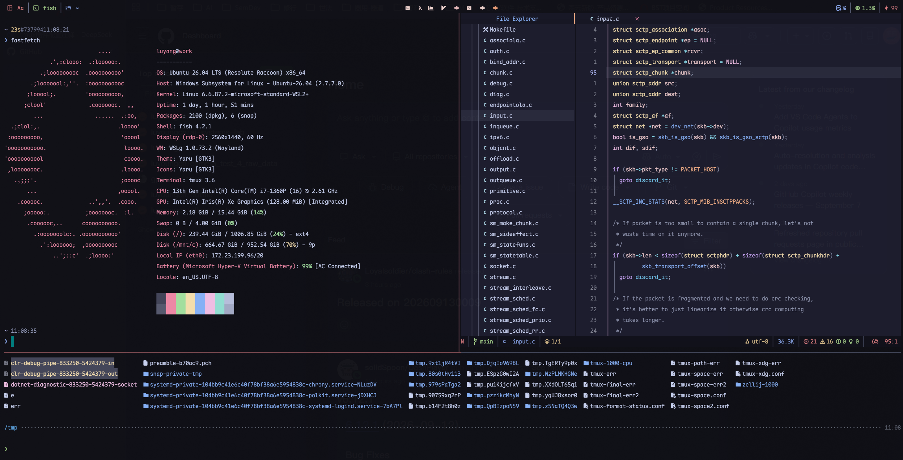

# dotfiles

Personal Linux/WSL development-environment configuration for Neovim, tmux,
and Fish (with Starship).



## Architecture

This repository uses explicit configuration files and manual symbolic links.
`install.sh` is the deployment entry point; it does not use GNU Stow or
chezmoi, and it does not change the login shell.

| Area | Repository entry point | Deployment target | Managed by `install.sh` |
| --- | --- | --- | --- |
| Neovim | `nvim/` | `${XDG_CONFIG_HOME:-~/.config}/nvim` | Yes, directory link |
| tmux | `tmux/tmux.conf` | `${XDG_CONFIG_HOME:-~/.config}/tmux/tmux.conf` | Yes |
| tmux palette | `tmux/colors.conf` | `${XDG_CONFIG_HOME:-~/.config}/tmux/colors.conf` | Yes |
| Fish | `fish/config.fish`, `fish/conf.d/` | `${XDG_CONFIG_HOME:-~/.config}/fish/` | Yes, per-file links |
| Fisher manifest | `fish/fish_plugins` | `${XDG_CONFIG_HOME:-~/.config}/fish/fish_plugins` | Yes |
| Starship | `starship/starship.toml` | `${XDG_CONFIG_HOME:-~/.config}/starship.toml` | Yes |

## Shell model

Fish is the interactive shell, with Starship as the prompt. Scripts keep their
own shebang (`#!/usr/bin/env bash`); no configuration in this repository calls
`chsh`, so switching the login shell is optional and left to you.

## Prerequisites

The installer assumes `sh`, `git`, and a writable home directory. It installs
TPM but does not install system packages, Neovim, tmux, Fish, Nerd Fonts,
Starship, or command-line tools.

On Ubuntu/WSL, install a practical baseline with:

```sh
sudo apt update
sudo apt install -y git curl tmux fish fzf ripgrep fd-find
```

Install shell-specific managers and themes as described in:

- [Fish, Fisher, and Starship](fish/README.md)
- [Starship prompt](starship/README.md)
- [Tmux and TPM](tmux/README.md)
- [Neovim/LazyVim](nvim/README.md)

## Deployment

Clone the repository and run the installer:

```sh
git clone <your-repository-url> ~/Document/dotfile
cd ~/Document/dotfile
./install.sh
```

Existing target files are moved to timestamped sibling backups before a link
is created. Fish is handled per file so Fisher-generated functions,
completions, plugin `conf.d` files, and `fish_variables` remain untouched.

TPM defaults to `${XDG_CONFIG_HOME:-~/.config}/tmux/plugins`. Override its
location before deployment when required:

```sh
TMUX_PLUGIN_MANAGER_PATH="$HOME/.tmux/plugins" ./install.sh
```

The installer does not install Fisher plugins. After installing Fish and
Fisher, synchronize the repository manifest with:

```sh
fish -c 'fisher update'
```

## Component summary

### Neovim

LazyVim is the base distribution managed by `lazy.nvim`. Personal plugin
specifications live in `nvim/lua/plugins/`; Catppuccin Mocha, bufferline,
Noice/Snacks, and the custom lualine statusline are configured there. See the
[Neovim README](nvim/README.md) and the [development guide](nvim/lazyvim-development-guide.md).

### tmux

The standalone `tmux/tmux.conf` owns options, `Ctrl-a` bindings, plugin
declarations, status-bar layout, and pane/window styles. `colors.conf` provides
the Catppuccin Frappé palette. TPM is initialized at the end of the file; the
oh-my-tmux dependency and `tmux.conf.local` have been removed. See
[tmux/README.md](tmux/README.md) for plugin controls and pane zoom behavior.

### Fish

Fish uses Fisher with a manifest containing `z`, `fzf.fish`, `done`, `bass`, and
`nvm.fish`. Configuration is split into `config.fish` (Starship prompt init) and
numbered `conf.d/` modules; the Docker SDK helpers (`denter` + `bst_sdk_*`),
WSL proxy functions, AI environment variables, and private `fish.local` loading
live there. See [fish/README.md](fish/README.md).

### Starship

Starship is the prompt for Fish, with a One Dark two-line theme. See
[starship/README.md](starship/README.md).

## Verification

After deployment, verify links and shell configuration:

```sh
git status --short
sh -n install.sh
tmux -V
fish --version
fish -c 'fisher list'
starship --version
```

For an interactive check, run `fish`, start tmux, and confirm the Catppuccin
status bar and the Starship prompt render with the installed Nerd Font.

## Updating the repository

Edit repository files, rerun `./install.sh` when links need refreshing, and
commit only the component being changed:

```sh
git add nvim tmux fish starship README.md install.sh
git commit
```

Keep generated plugin directories, caches, `fish_variables`, and private
credential files outside Git. Review timestamped backups before removing any
old local configuration.
